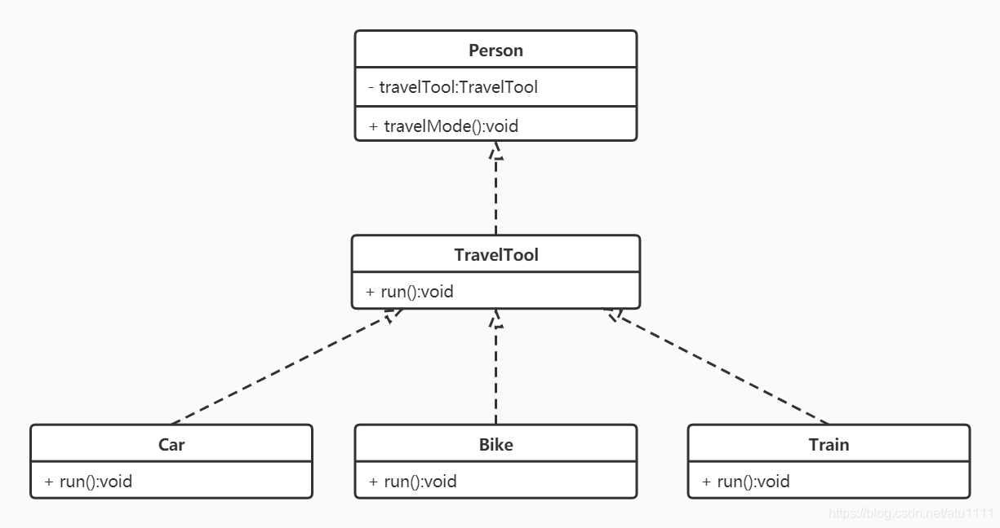

# 什么是依赖倒转原则？

依赖倒转原则（Dependency Inversion Principle，DIP）是面向对象设计中的一个重要原则，由罗伯特·C·马丁（Robert C. Martin）提出。它强调了高层模块不应该依赖于低层模块，二者都应该依赖于抽象；同时，抽象不应该依赖于细节，细节应该依赖于抽象。简而言之，依赖倒转原则可以用以下两句话来概括：

1. 高层模块不应该依赖于低层模块，二者都应该依赖于抽象。
2. 抽象不应该依赖于细节，细节应该依赖于抽象。

依赖倒转原则的核心思想是通过抽象来解耦各个模块之间的依赖关系，使得系统更加灵活、可扩展和易于维护。它通常通过以下几个方面来实现：

1. **使用抽象类或接口：** 高层模块应该依赖于抽象类或接口，而不是具体的实现类。这样可以将系统的依赖关系从具体的实现中解耦，提高了系统的灵活性和可维护性。
2. **依赖注入：** 通过依赖注入的方式将依赖关系从高层模块中注入进来，而不是在高层模块内部直接创建依赖的对象。这样可以使得高层模块更加独立和可测试，便于替换和扩展依赖关系。
3. **使用工厂模式：** 工厂模式可以用来创建对象的实例，通过工厂方法或抽象工厂来创建对象，使得高层模块不需要关心对象的具体创建细节，降低了模块之间的耦合度。
4. **使用依赖倒置的设计模式：** 许多设计模式都遵循依赖倒置原则，例如工厂模式、策略模式、观察者模式等。这些设计模式提供了一种灵活的方式来解耦模块之间的依赖关系，同时保持了系统的稳定性和可维护性。

# 为什么需要依赖倒转原则？

依赖倒转原则（Dependency Inversion Principle，DIP）是面向对象设计中的一个重要原则，它的存在有以下几个重要原因：

1. **降低耦合度：** 依赖倒转原则通过将系统的依赖关系从具体的实现中解耦，使得高层模块不再直接依赖于低层模块的具体实现，而是依赖于抽象。这样可以降低模块之间的耦合度，提高系统的灵活性和可维护性。
2. **提高可扩展性：** 通过依赖倒转原则，系统的各个模块之间的依赖关系变得更加灵活，可以更容易地进行扩展和修改。当系统的需求发生变化时，可以通过替换依赖的实现来实现新的功能，而不需要修改现有的代码。
3. **增强可测试性：** 依赖倒转原则使得系统的各个模块之间的依赖关系更加松散，可以更容易地进行单元测试和集成测试。通过将依赖的实现从高层模块中注入进来，可以轻松地替换依赖的实现，并对模块进行单独测试，提高了系统的可测试性。
4. **促进代码复用：** 依赖倒转原则使得系统的各个模块之间的依赖关系更加灵活，可以更容易地实现模块的复用。通过将依赖的实现从高层模块中抽象出来，可以将相同的依赖关系应用到不同的模块中，提高了代码的复用性。
5. **提高系统的稳定性和可维护性：** 依赖倒转原则通过降低模块之间的耦合度，提高了系统的灵活性和可维护性。当系统的需求发生变化时，可以通过替换依赖的实现来实现新的功能，而不需要修改现有的代码，降低了引入错误和不稳定性的风险，提高了系统的稳定性和可维护性。

# 如何使用依赖倒转原则？

使用依赖倒转原则（Dependency Inversion Principle，DIP）可以通过以下几种方式来实现：

1. **使用抽象类或接口：** 定义抽象类或接口来描述系统的通用行为，高层模块应该依赖于抽象类或接口，而不是具体的实现类。这样可以将系统的依赖关系从具体的实现中解耦，提高了系统的灵活性和可维护性。
2. **依赖注入（Dependency Injection）：** 依赖注入是一种通过外部注入依赖的方式来解耦模块之间的关系。通过将依赖的实现从高层模块中注入进来，而不是在高层模块内部直接创建依赖的对象，可以使得高层模块更加独立和可测试，便于替换和扩展依赖关系。
3. **使用工厂模式（Factory Pattern）：** 工厂模式可以用来创建对象的实例，通过工厂方法或抽象工厂来创建对象，使得高层模块不需要关心对象的具体创建细节。这样可以将依赖的实现从高层模块中解耦出来，提高了系统的灵活性和可维护性。
4. **使用依赖注入容器（Dependency Injection Container）：** 依赖注入容器是一种用来管理对象之间依赖关系的容器，它可以自动地根据配置文件或注解来注入依赖的实现。通过使用依赖注入容器，可以使得系统的依赖关系更加清晰、灵活和易于维护。
5. **使用依赖倒置的设计模式：** 许多设计模式都遵循依赖倒置原则，例如工厂模式、策略模式、观察者模式等。这些设计模式提供了一种灵活的方式来解耦模块之间的依赖关系，同时保持了系统的稳定性和可维护性。

