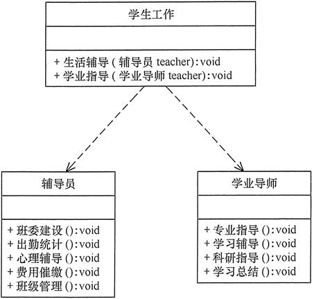

# 什么是单一职责原则？

单一职责原则在几乎每一个设计模式中都有体现！

单一职责原则（Single Responsibility Principle，SRP）是面向对象设计中的一个基本原则，由罗伯特·C·马丁（Robert C. Martin）提出。它强调一个类应该**只有一个责任**，或者说一个类应该只有一个原因引起它的变化。换句话说，**一个类应该只有一个引起它修改的原因**。

具体来说，单一职责原则表明一个类、模块或函数应该只负责一项功能或任务，并且在该功能上应该是完整的、高内聚的。如果一个类承担了多个不同的责任，那么这些责任可能会相互耦合，使得类变得复杂、难以理解和难以维护。

单一职责原则的核心思想是将系统中的每个功能或任务分解为更小的、单一的功能单元，每个功能单元都由一个独立的类、模块或函数来负责。这样可以使得代码更加模块化、可维护性更强、重用性更高，并且降低了系统的耦合度。

# 为什么需要单一职责原则？

1. **易于理解和维护：** 类的责任越单一，其代码越简洁明了。当类的功能过多时，代码就会变得复杂难以理解，而且修改其中的一部分可能会影响到其他部分的功能，导致不可预测的行为。遵循单一职责原则可以降低代码的复杂度，使得代码更易于理解和维护。
2. **降低耦合性：** 单一职责原则有助于降低类之间的耦合度。当一个类承担多个职责时，这些职责之间可能存在依赖关系，导致类之间的耦合性增加。通过将每个职责封装到不同的类中，可以降低类之间的耦合度，提高代码的灵活性和可重用性。
3. **提高代码的可测试性：** 类的职责单一化可以使得单元测试更加容易。当一个类只有一个职责时，可以更轻松地编写单元测试来验证其功能是否正确。这样可以提高代码的质量和稳定性。
4. **提高代码的重用性：** 单一职责原则有助于提高代码的可重用性。当一个类只负责一个职责时，它的功能更加专注，可以更容易地被其他模块或组件重用。

# 如何使用单一职责？

1. **分析功能和职责：** 首先，对系统的功能进行分析，确定每个功能的职责。一个功能应该只有一个责任，即使这个责任可能包含多个子任务。
2. **识别类和模块：** 将系统中的功能划分为不同的类或模块，每个类或模块都应该专注于实现一个特定的功能或任务。确保每个类或模块都只有一个引起它变化的原因。
3. **确保高内聚：** 在设计类或模块时，确保它们的功能是高内聚的，即相似的功能应该放在同一个类或模块中。这样可以确保类或模块的功能清晰明确，易于理解和维护。
4. **分离关注点：** 确保类或模块只关注自己的职责，而不涉及其他功能的实现细节。这样可以降低类或模块之间的耦合度，提高代码的灵活性和可维护性。
5. **重构和优化：** 如果发现某个类或模块承担了过多的责任，或者功能不够单一，就需要进行重构和优化。可以将功能拆分为更小的单元，创建新的类或模块来专门处理这些单元，以确保每个类或模块都遵循单一职责原则。
6. **持续改进：** 单一职责原则不仅适用于初始设计阶段，还应该在代码演进过程中持续应用。随着需求的变化和系统的演进，不断地审视和优化代码，确保每个类或模块都保持单一职责，是保持代码质量和可维护性的重要手段之一。

