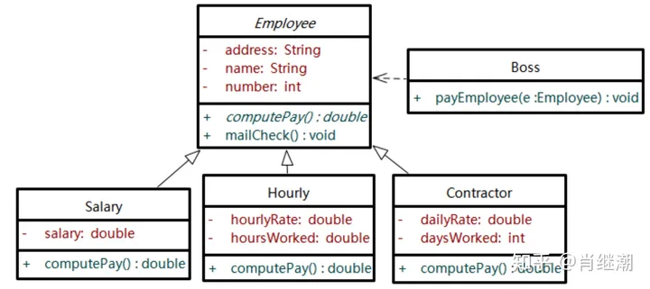

# 什么是开闭原则？

开闭原则（Open-Closed Principle，OCP）是面向对象设计中的一个基本原则，由伯特兰·梅耶（Bertrand Meyer）提出。它指出软件实体（类、模块、函数等）应该对扩展开放，对修改关闭，即一个软件实体应该在不修改原有代码的情况下，可以通过扩展来实现新的功能或行为。

具体来说，开闭原则的核心思想可以概括为：当需求发生变化时，应该通过增加新的代码来扩展现有功能，而不是修改已有的代码。这意味着要设计出一种灵活的架构，使得系统的各个部分可以独立地进行扩展和修改，而不会影响到其他部分的正常运行。

开闭原则有以下几个关键点：

1. **对扩展开放：** 意味着软件实体应该允许在不修改原有代码的情况下进行扩展，通过新增代码来增加新的功能或行为。
2. **对修改关闭：** 意味着在增加新功能时不应该修改已有的代码，以避免破坏原有的功能和稳定性。
3. **通过抽象和多态实现：** 可以通过抽象和多态的技术来实现开闭原则。使用抽象类或接口定义通用的抽象行为，然后通过子类或实现类来扩展和具体化这些抽象行为。
4. **使用设计模式：** 许多设计模式都遵循开闭原则，例如策略模式、装饰器模式、观察者模式等。这些设计模式提供了一种灵活的方式来扩展和修改系统的功能，同时保持了系统的稳定性和可维护性。

# 为什么需要开闭原则？

开闭原则（Open-Closed Principle，OCP）是面向对象设计中的一个基本原则，它强调了系统应该具有扩展性和灵活性，同时保持稳定性和可维护性。以下是为什么需要开闭原则的几个重要原因：

1. **适应需求变化：** 在软件开发过程中，需求经常发生变化。如果系统的设计不具备扩展性，那么每次需求变化都需要修改现有的代码，这会增加系统的复杂度和风险，同时也会增加修改代码的成本和时间。开闭原则通过对扩展开放、对修改关闭的原则，使得系统能够更加灵活地适应需求变化，通过扩展而不是修改来实现新的功能。
2. **保持代码稳定性：** 修改现有的代码可能会引入错误和不稳定性，特别是在大型和复杂的系统中。开闭原则通过尽量减少对现有代码的修改，可以降低引入错误的风险，保持代码的稳定性和可靠性。
3. **提高代码的可维护性：** 通过遵循开闭原则，系统的各个部分都可以独立地进行扩展和修改，而不会影响到其他部分。这样可以使得代码更加模块化、清晰、易于理解和维护，降低了系统的耦合度和复杂度，提高了代码的可维护性。
4. **增强系统的可复用性：** 开闭原则鼓励设计出灵活、可扩展的系统架构，这样可以使得系统中的各个模块更容易被复用。通过扩展现有的功能来实现新的需求，可以最大程度地利用已有的代码和资源，提高了代码的可复用性和资源的利用率。
5. **促进团队协作：** 开闭原则鼓励将系统分解为独立的、相互关联的模块，每个模块都可以独立地进行扩展和修改。这种模块化的设计有利于团队成员之间的分工合作，提高了团队的效率和协作能力。

# 如何使用开闭原则？

使用开闭原则（Open-Closed Principle，OCP）需要遵循以下几个指导原则：

1. **抽象化和接口定义：** 定义抽象类或接口来描述系统的通用行为，而不是依赖于具体的实现。这样可以使得系统更容易扩展，通过增加新的实现来实现新的功能，而不需要修改现有的代码。
2. **通过多态实现：** 使用多态性来实现系统的灵活性。通过将实际的对象赋值给抽象类型的变量或参数，可以在运行时动态地选择不同的实现。这样可以使得系统更容易扩展，而不需要修改现有的代码。
3. **使用设计模式：** 许多设计模式都遵循开闭原则，例如策略模式、装饰器模式、观察者模式等。这些设计模式提供了一种灵活的方式来扩展和修改系统的功能，同时保持了系统的稳定性和可维护性。
4. **模块化和组件化设计：** 将系统分解为独立的、相互关联的模块或组件，每个模块或组件都应该具有清晰的职责和接口。这样可以使得系统更容易扩展，通过增加新的模块或组件来实现新的功能，而不需要修改现有的代码。
5. **避免硬编码和紧耦合：** 尽量避免在代码中硬编码具体的实现和依赖关系，而是使用抽象的接口或配置来描述系统的行为和关系。这样可以使得系统更容易扩展，通过修改配置或替换实现来实现新的功能，而不需要修改现有的代码。

