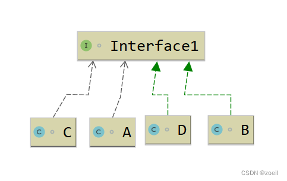

# 什么是接口隔离原则？

接口隔离原则(Interface Segregation Principle, ISP)是SOLID五大面向对象设计原则之一,由罗伯特·马丁提出。它的核心思想是:

1. 客户端不应该依赖它不需要的接口。换句话说,一个类应该只依赖它需要的方法,而不应该依赖它不需要的方法。
2. 接口应该细化,而不应该臃肿。一个接口应该只包含相关的、紧密联系的方法,而不应该包含一些没有任何关系的方法。

遵循接口隔离原则的好处包括:

1. 提高代码的灵活性和可维护性。当一个接口发生变化时,只会影响直接依赖该接口的类,而不会牵连到其他无关的类。
2. 降低代码的耦合度。每个类只需要依赖它需要的方法,而不需要依赖它不需要的方法,这样可以降低类之间的耦合度。
3. 促进接口的单一职责。接口应该只负责一个相关的功能领域,而不应该承担太多的职责。这样可以让接口更加清晰和易于理解。
4. 提高代码的可测试性。由于接口之间的耦合度降低,可以更容易地对各个接口进行单元测试。

# 为什么要使用接口隔离原则？

使用接口隔离原则的主要原因如下:

1. 提高代码的可维护性:
   * 如果一个接口包含了太多无关的方法,当其中一个方法需要修改时,会影响到所有依赖该接口的类。
   * 接口隔离原则要求接口只包含相关的方法,这样可以降低接口的耦合度,提高代码的可维护性。
2. 增强代码的灵活性:
   * 如果一个类依赖了它不需要的接口方法,会造成不必要的依赖。
   * 接口隔离原则要求类只依赖它需要的方法,可以提高代码的灵活性,降低修改成本。
3. 促进接口的单一职责:
   * 一个接口应该只负责一个相关的功能领域,而不应该承担太多的职责。
   * 接口隔离原则有助于设计出更加清晰和易于理解的接口。
4. 提高代码的可测试性:
   * 如果一个类依赖了太多无关的接口方法,会增加单元测试的复杂度。
   * 接口隔离原则可以降低类之间的耦合度,从而提高代码的可测试性。
5. 减少代码中的冗余:
   * 如果一个接口包含了太多无关的方法,会导致代码中出现大量的重复实现。
   * 接口隔离原则有助于设计出更加简洁和高内聚的接口,减少代码中的冗余

# 如何使用接口隔离原则？

使用接口隔离原则的主要方法包括:

1. 识别接口的职责边界:
   * 仔细分析接口的用途和所包含的方法,确定它们是否属于同一个功能领域。
   * 如果接口中包含了一些不相关的方法,则应该将其拆分为多个更细粒度的接口。
2. 遵循单一职责原则:
   * 每个接口应该只负责一个相关的功能领域,而不应该承担太多的职责。
   * 如果一个接口承担了多个职责,应该将其拆分为多个专注于单一职责的接口。
3. 最小化接口依赖:
   * 客户端只应该依赖它需要的接口方法,而不应该依赖它不需要的方法。
   * 如果一个类需要使用接口中的部分方法,应该创建一个更细粒度的接口,让该类只依赖它需要的部分。
4. 利用接口继承:
   * 可以使用接口继承来创建更细粒度的接口。
   * 子接口可以继承父接口的部分方法,并添加更多相关的方法。
5. 避免"胖接口":
   * 如果一个接口包含了太多不相关的方法,应该将其拆分为多个更小的接口。
   * 这样可以让接口更加专注,降低客户端的依赖,提高代码的可维护性。
6. 进行接口设计评审:
   * 在设计接口时,应该邀请其他开发人员进行评审,确保接口设计符合接口隔离原则。
   * 评审时应该关注接口的职责边界、方法相关性、客户端依赖等方面。

