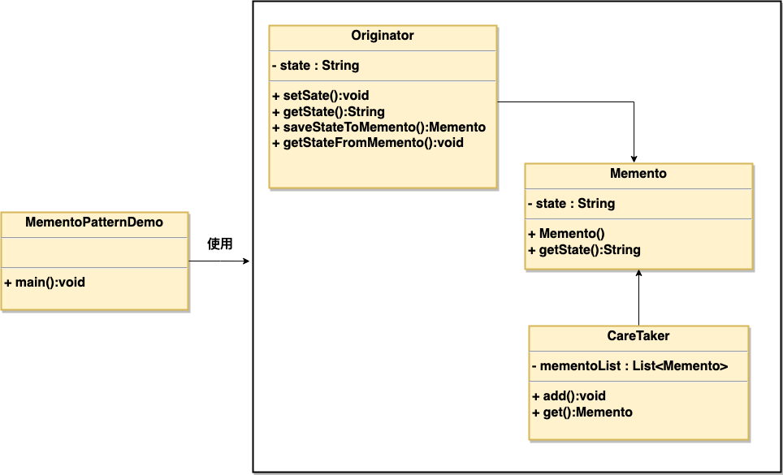

# 备忘录模式:

用于恢复和保持原始状态

选择出一个类作为备忘录，记录现有的状态。

# uml类图：

本质：

其实就是通过一对方法返回当前对象的值
因为不能从外部获取，就从内部获取，用一个list存储

主要解决的问题

允许捕获并保存一个对象的内部状态，以便在将来可以恢复到该状态，实现撤销和回滚操作。

使用场景

当需要提供一种撤销机制，允许用户回退到之前的状态时。

实现方式

创建备忘录类：用于存储和封装对象的状态。
创建发起人角色：负责创建备忘录，并根据需要恢复状态。
创建备忘录管理类（可选）：负责管理所有备忘录对象。

关键代码

备忘录：存储发起人的状态信息。
发起人：创建备忘录，并根据备忘录恢复状态。
