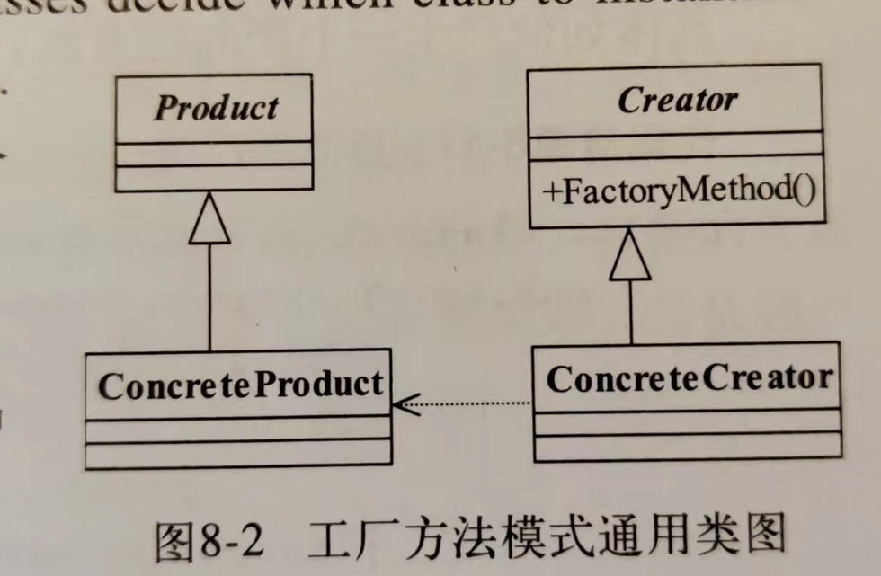

# 工厂模式：

一句话概括：

优点：

1. **封装对象创建逻辑**：工厂模式将对象的创建逻辑封装在工厂类中，客户端不需要了解对象的创建细节，只需要通过工厂类来获取所需的对象。这样可以降低客户端与具体类之间的耦合度。
2. **统一管理对象创建**：工厂模式集中管理对象的创建过程，可以更容易地进行管理和维护。如果需要修改对象的创建逻辑，只需要修改工厂类而不需要修改客户端代码。
3. **提高代码的可扩展性**：通过工厂模式，可以轻松地添加新的产品类，而不需要修改现有的代码。只需要创建一个新的产品类和对应的工厂类即可。
4. **隐藏具体实现细节**：工厂模式将具体类的实现细节隐藏在工厂类中，客户端不需要了解每个具体类的实现细节，只需要知道如何通过工厂类获取所需的对象即可。
5. **与单一职责原则相符合**：工厂模式可以将对象的创建逻辑从客户端代码中分离出来，符合单一职责原则，每个类都只负责一种功能。

缺点：

1. **增加了代码复杂性**：引入工厂模式会增加额外的类和接口，可能会增加代码的复杂性，特别是在简单场景下可能显得繁琐。
2. **增加了系统的抽象度**：工厂模式将对象的创建逻辑抽象到工厂类中，可能会增加系统的抽象度，使得代码更加难以理解和维护。
3. **不适合简单对象的创建**：对于简单的对象创建，引入工厂模式可能会显得过度设计，增加了不必要的复杂性。
4. **可能引入不必要的类**：每个产品类都需要对应一个工厂类，如果产品类很多，可能会引入大量的工厂类，增加了类的数量和管理的复杂性。
5. **不易于单元测试**：由于工厂类通常负责创建对象的实例化，测试时可能需要模拟工厂类来创建对象，这增加了单元测试的难度。
6. **不够灵活**：工厂模式一般用于创建固定类型的对象，如果需要根据条件动态地创建对象，可能需要引入其他设计模式或者增加工厂方法的逻辑，使得工厂模式不够灵活。

