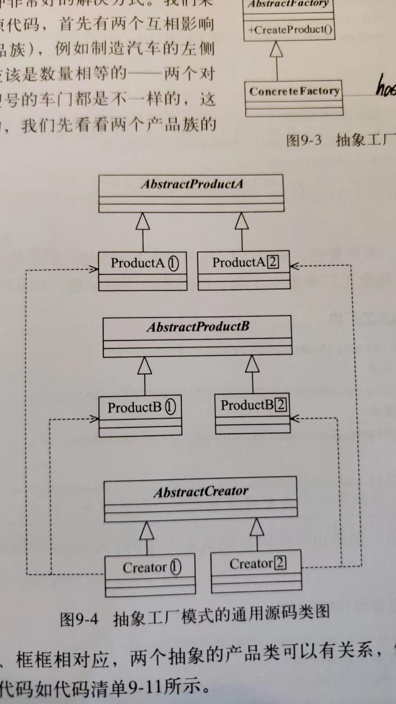
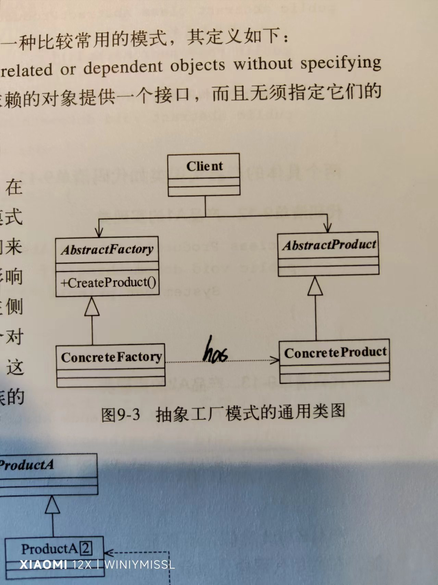
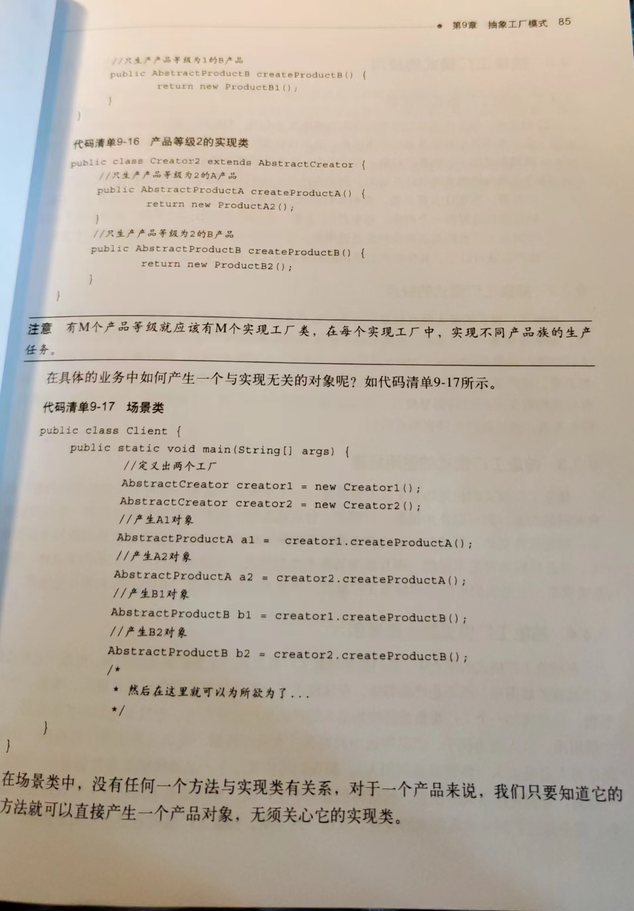

# 抽象工厂模式

抽象工厂模式和工厂模式都是用于创建对象的设计模式，它们之间的区别主要在于其创建对象的方式和目的：

1. **工厂模式（Factory Pattern）**：
   * 工厂模式关注于单个产品等级结构的创建，它定义了一个用于创建对象的接口，但具体的对象创建过程由子类来实现。
   * 工厂模式通常包括一个工厂接口和多个具体工厂类，每个具体工厂类负责创建一种具体类型的对象。
   * 适用于创建单一种类的对象，不同的具体工厂类可以创建不同类型的对象，但都属于同一个产品等级结构。
2. **抽象工厂模式（Abstract Factory Pattern）**：
   * 抽象工厂模式关注于多个产品等级结构的创建，它提供了一个接口用于创建一系列相关或相互依赖的对象，而不需要指定具体的类。
   * 抽象工厂模式包括一个抽象工厂接口和多个具体工厂类，每个具体工厂类负责创建一系列相关的对象。
   * 每个具体工厂类可以创建多个不同类型的对象，这些对象通常属于不同的产品等级结构，但是在抽象工厂模式中，这些产品等级结构通常是相关联的。
   * 适用于创建多个相关联的产品族，例如创建不同操作系统下的界面组件，可以有一个抽象工厂用于创建按钮、文本框等界面组件，而具体的工厂类可以创建不同操作系统下的按钮、文本框等对象。

## 定义：

通用源码类图

