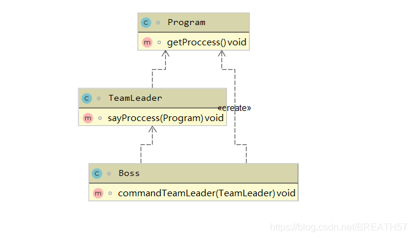

# 什么是迪米特原则？

迪米特原则的关键定义：

##### 什么是朋友？

朋友：类中的属性，和所有方法的入参和返回参数，是朋友 ，以及由其直接创建的对象的方法。

迪米特原则（Law of Demeter，LoD），也称为最少知识原则（Principle of Least Knowledge，PLK），是面向对象设计中的一个重要原则，其核心思想是一个对象应该对其他对象有尽可能少的了解，也就是一个对象应该对其他对象的结构和行为了解得越少越好。

迪米特原则的主要目标是降低系统的耦合度，提高系统的灵活性、可维护性和可扩展性。它强调对象之间应该保持松散的耦合关系，避免对象之间直接的依赖关系过多，减少系统中各个模块之间的相互影响，从而使得系统更加稳定和可靠。

迪米特原则通常可以通过以下几个准则来实现：

1. **只与直接的朋友通信：** 一个对象只应该调用其本身的方法、成员变量、方法参数等，以及由其直接创建的对象的方法。不应该调用任何非直接关联的对象的方法。
2. **尽量减少对象之间的交互：** 两个对象之间的交互应该尽可能地简单直接，避免通过多层的对象链进行通信。
3. **封装对象的行为和状态：** 对象应该封装自己的行为和状态，对外部对象提供尽可能少的公开接口，以减少外部对象对其内部结构的依赖。
4. **使用中介者模式或观察者模式：** 对象之间的复杂交互可以通过中介者模式或观察者模式来实现，从而减少对象之间的直接依赖关系。

# 为什么需要迪米特原则？

迪米特原则（Law of Demeter，LoD），也称为最少知识原则（Principle of Least Knowledge，PLK），是面向对象设计中的一个重要原则。它强调一个对象应该对其他对象有尽可能少的了解，或者说一个对象应该只与其直接的朋友通信。

迪米特原则的存在有以下几个重要原因：

1. **降低耦合度：** 迪米特原则有助于降低系统中各个模块之间的耦合度。当一个对象只与其直接的朋友通信时，它不需要了解其他对象的内部结构和实现细节，这样可以降低对象之间的依赖关系，减少代码的耦合度，提高系统的灵活性和可维护性。
2. **提高模块独立性：** 当一个模块只与其直接的朋友通信时，它的功能实现更加独立，不受其他模块的影响。这样可以提高模块的独立性，使得系统更易于理解、扩展和维护。
3. **减少错误传播：** 当一个模块只与其直接的朋友通信时，错误的传播范围更小。如果一个模块依赖于太多的其他模块，那么当其中一个模块出现错误时，可能会影响到整个系统的稳定性和可靠性。而当一个模块只与其直接的朋友通信时，错误只会在局部范围内传播，不会影响到其他模块。
4. **增强安全性：** 迪米特原则可以增强系统的安全性，减少不必要的信息暴露。当一个对象只与其直接的朋友通信时，它不需要了解其他对象的内部结构和实现细节，也就减少了敏感信息的暴露和泄露的风险。

# 如何使用迪米特原则？

使用迪米特原则（最少知识原则）来设计和编写代码需要遵循以下几个指导原则：

1. **只与直接的朋友通信：** 对象应该只与其直接的朋友通信，即只调用其本身的方法、成员变量、方法参数等，以及由其直接创建的对象的方法。不应该调用任何非直接关联的对象的方法。
2. **封装对象的行为和状态：** 对象应该封装自己的行为和状态，对外部对象提供尽可能少的公开接口，以减少外部对象对其内部结构的依赖。这样可以降低对象之间的耦合度，提高系统的灵活性和可维护性。
3. **使用中介者模式或观察者模式：** 对象之间的复杂交互可以通过中介者模式或观察者模式来实现，从而减少对象之间的直接依赖关系。中介者模式通过一个中介对象来封装对象之间的交互，观察者模式通过定义一种一对多的依赖关系来实现对象之间的通信。
4. **避免过多的层次关系：** 尽量避免过多的对象层次关系，尽量保持对象之间的层次结构扁平化。过多的层次关系会增加代码的复杂度，降低系统的可维护性和可扩展性。
5. **避免传递过多的参数：** 尽量避免在方法之间传递过多的参数，这会增加方法之间的耦合度。可以通过封装参数为对象或者使用依赖注入等方式来减少方法之间的依赖关系。
6. **遵循依赖倒置原则：** 依赖倒置原则要求依赖于抽象而不是具体实现，这可以减少对象之间的直接依赖关系，提高代码的灵活性和可维护性。

使用迪米特原则（最少知识原则）来设计和编写代码需要遵循以下几个指导原则：

1. **只与直接的朋友通信：** 对象应该只与其直接的朋友通信，即只调用其本身的方法、成员变量、方法参数等，以及由其直接创建的对象的方法。不应该调用任何非直接关联的对象的方法。
2. **封装对象的行为和状态：** 对象应该封装自己的行为和状态，对外部对象提供尽可能少的公开接口，以减少外部对象对其内部结构的依赖。这样可以降低对象之间的耦合度，提高系统的灵活性和可维护性。
3. **使用中介者模式或观察者模式：** 对象之间的复杂交互可以通过中介者模式或观察者模式来实现，从而减少对象之间的直接依赖关系。中介者模式通过一个中介对象来封装对象之间的交互，观察者模式通过定义一种一对多的依赖关系来实现对象之间的通信。
4. **避免过多的层次关系：** 尽量避免过多的对象层次关系，尽量保持对象之间的层次结构扁平化。过多的层次关系会增加代码的复杂度，降低系统的可维护性和可扩展性。
5. **避免传递过多的参数：** 尽量避免在方法之间传递过多的参数，这会增加方法之间的耦合度。可以通过封装参数为对象或者使用依赖注入等方式来减少方法之间的依赖关系。
6. **遵循依赖倒置原则：** 依赖倒置原则要求依赖于抽象而不是具体实现，这可以减少对象之间的直接依赖关系，提高代码的灵活性和可维护性。

