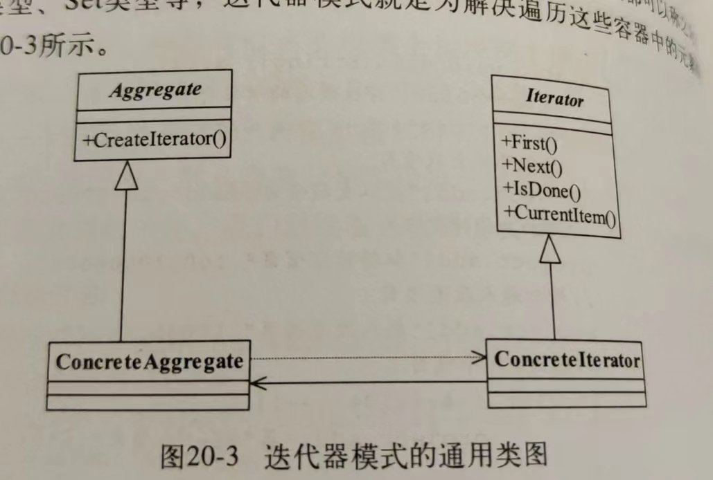

# 迭代器模式：

迭代器模式（Iterator Pattern）是一种行为型设计模式，它用于提供一种方法来顺序访问一个聚合对象中的各个元素，而不暴露该对象的内部表示。该模式将遍历和聚合对象解耦，使得可以在不改变聚合对象结构的情况下，统一地访问聚合对象中的元素。

迭代器模式包括以下几个关键角色：

1. **迭代器（Iterator）**：定义了访问和遍历聚合对象元素的接口。迭代器通常提供了 hasNext() 方法用于判断是否还有下一个元素，以及 next() 方法用于获取下一个元素。
2. **具体迭代器（Concrete Iterator）**：实现了迭代器接口，负责遍历聚合对象中的元素。
3. **聚合对象（Aggregate）**：定义了创建迭代器对象的接口。聚合对象通常会有一个或多个方法用于返回迭代器对象。
4. **具体聚合对象（Concrete Aggregate）**：实现了聚合对象接口，负责创建具体迭代器对象，并且通常包含了需要被遍历的元素集合。

# 一句话概括：

迭代器模式提供了一种统一的方法来访问一个聚合对象中的各个元素，而不需要暴露该对象的内部表示。

# uml类图：

