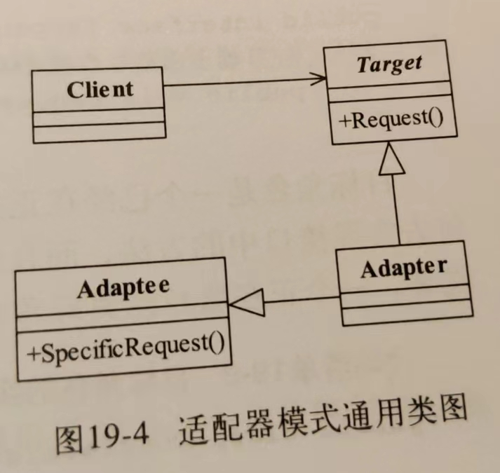

# 适配器模式的定义：

适配器模式（Adapter Pattern）是一种结构型设计模式，它允许将一个类的接口转换成客户端所期望的另一个接口。这种模式通常用于解决接口不兼容的问题，使得原本由于接口不匹配而无法协同工作的类能够一起工作。

也别称之为变压器模式

适配器模式，可以让两个没有任何关系的类，运行在一起

# 应用场景：

用于已经正在服役的项目，

# 一句话概括：

**通过中间层将一种接口转化为另一种接口。**

# uml类图：

