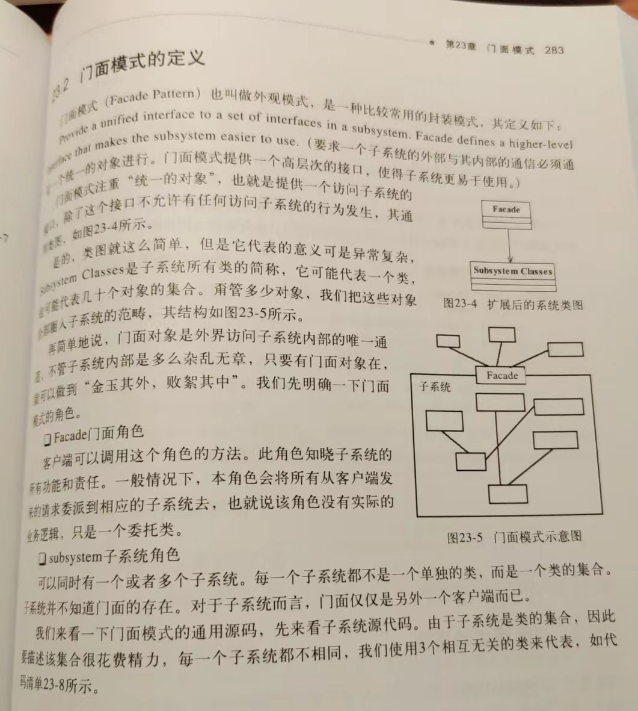

# 门面设计模式：

也叫做外观设计模式

门面设计模式（Facade Design Pattern）提供了一个统一的接口，用于访问子系统中的一组接口。它隐藏了子系统的复杂性，使得客户端代码可以更简洁地与系统交互。

优点：

1. 简化客户端与子系统之间的交互，提供了一个高层次的接口，减少了客户端与子系统之间的耦合。
2. 将子系统的复杂性封装起来，使得客户端代码更容易理解和维护。
3. 降低了客户端与子系统之间的依赖关系，提高了系统的灵活性和可扩展性。

缺点：

1. 如果门面类设计不当，可能会导致门面类变得庞大而复杂，违背了单一职责原则。
2. 可能会出现滥用门面模式的情况，导致系统的设计变得过于简单和僵化。

# uml类图：

